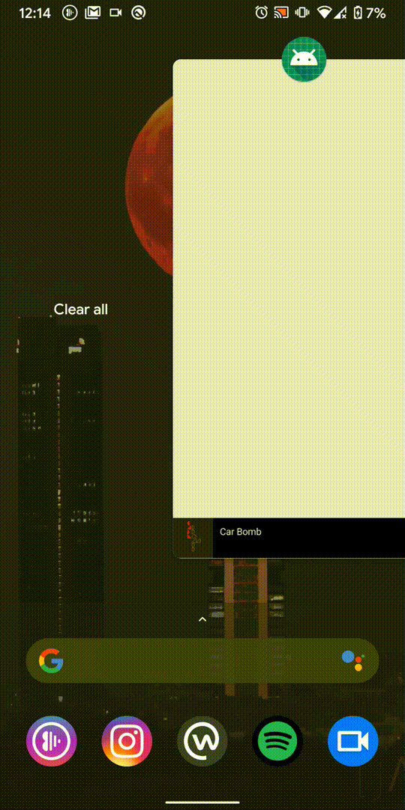

# PlayerAnimation

An attempt to creating an expanding Player layout for music streaming apps. The layout starts as a minimized player, then expands into a full-sized player.

This should be easily done using MotionLayout, but the challenge here is to have 2 separate fragments for the Miniplayer and the Player, while transitionning a ImageView between the two

